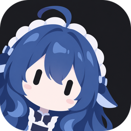

# DeepSeek Harness 桌面快捷方式

给 [DeepSeek Harness](https://github.com/deepseek-ai)（`dsh web`）做一个 Windows 桌面图标：
**双击就打开 Harness 的 Web GUI** —— 服务已经在跑就直接开页面，没跑就静默地在后台把它拉起来。

> 非官方项目，与 DeepSeek 官方无关。图标素材与出处详见「[来源与致谢](#来源与致谢)」。



## 它解决什么问题

`dsh web` 启动后，浏览器的地址并不是干净的 `http://127.0.0.1:3080/`，而是带一次性令牌的
`http://127.0.0.1:3080/?token=…`：每个进程生成一个新的 `token`，首次访问用它换取一个签名
Cookie，之后才认这个浏览器。**没有 Cookie 时直接访问干净地址会返回 401**——这正是
"建个快捷方式指向网址" 行不通的原因。

同时，命令行启动会弹一个控制台窗口，关掉窗口服务就没了，也不适合当桌面图标。

所以这个启动器把两件事都处理掉：

| 情况 | 行为 |
| --- | --- |
| `127.0.0.1:3080` 上已经有 `dsh web` | 直接用默认浏览器打开 `http://127.0.0.1:3080/`（靠浏览器里已有的 Cookie，实测 1 秒完成） |
| 没有在跑 | 以**无控制台窗口**的方式后台启动 `dsh web --no-open`，从启动日志里取出带 `token` 的地址，再用默认浏览器打开 |

结果：双击图标 → 页面打开，全程没有黑窗口；启动器自己立刻退出，服务继续在后台跑。

## 工作方式

```
桌面快捷方式 (DeepSeek Harness.lnk)
  └─ wscript.exe  open-dsh.vbs        ← GUI 子系统宿主，所以不会有控制台窗口
       └─ powershell -File open-dsh.ps1
            ├─ 探测 127.0.0.1:3080 是否已在监听 → 是：开页面，结束
            └─ 否：cmd /c "node <dsh>/lib/bin.js web --no-open --port 3080 > 日志 2>&1"
                     （CreateNoWindow 启动，日志由 cmd 自己重定向，完全脱离本进程）
                     轮询日志里的 http://127.0.0.1:<port>/?token=… → 开页面
```

几个实现上的要点：

* **不经过 PowerShell 的管道重定向**。后台服务会继承启动器的 stdout 句柄，用 PowerShell 的
  `Start-Process -RedirectStandardOutput` 会让启动器无法退出。日志交给 `cmd` 自己重定向，
  再用 `ProcessStartInfo` + `CreateNoWindow` 启动，进程之间彻底脱钩。
* **自己解析带 `token` 的地址**，而不是依赖 `dsh web` 自动开浏览器——这样冷启动也一定
  能进得去（自动开浏览器在 SSH 等环境下会被 DSH 主动跳过）。
* **`dsh` 入口自动发现**：依次找 `DSH_CLI` 环境变量 → `PATH` 里的 `dsh` →
  `%LOCALAPPDATA%\npm-cache\_npx\*\node_modules\@deepseek-ai\dsh\lib\bin.js`（按时间取最新，
  npx 升级换了哈希目录也能跟上）→ 全局 npm 安装 → `npx -y @deepseek-ai/dsh`。

## 安装

需要本机已经有 Node.js 和 `@deepseek-ai/dsh`（例如用过 `npx @deepseek-ai/dsh`）。

```powershell
git clone https://github.com/DANSHIROUYANG/deepseek-harness-desktop-shortcut.git
cd deepseek-harness-desktop-shortcut
powershell -NoProfile -ExecutionPolicy Bypass -File src\install.ps1
```

安装脚本做两件事：把 `src\open-dsh.ps1`、`src\open-dsh.vbs`、`assets\dsh.ico` 复制到
`%USERPROFILE%\.dsh\launcher`，然后在桌面创建 `DeepSeek Harness.lnk`。

> **不要用"另存为"或复制粘贴的方式搬运 `.ps1`**：脚本里有中文，必须是 **带 BOM 的 UTF-8**，
> 否则 Windows PowerShell 5.1 会按 ANSI 解码，某个汉字的尾字节会把换行"吃掉"从而导致
> 语法错误。仓库里的文件已经带 BOM，`.gitattributes` 也锁定了这一点。

## 使用与运维

| 想做的事 | 做法 |
| --- | --- |
| 打开 Harness | 双击桌面图标 |
| 换端口 | 改 `src\open-dsh.ps1` 顶部的 `$Port`，重跑一次 `install.ps1` |
| 看后台服务日志 | `%USERPROFILE%\.dsh\launcher\dsh-web.out.log` / `dsh-web.err.log`（每次冷启动覆盖） |
| 停掉后台服务 | `taskkill /PID (Get-Content "$env:USERPROFILE\.dsh\launcher\dsh-web.pid") /T /F` |
| 自检（含冷启动演练） | `powershell -NoProfile -ExecutionPolicy Bypass -File tools\verify.ps1` |
| 卸载 | 删掉桌面快捷方式和 `%USERPROFILE%\.dsh\launcher` 目录 |

`tools\verify.ps1` 会检查脚本能否被 PowerShell 5.1 正确解析、`dsh` 入口能否解析到、
热启动与冷启动分别会打开哪个地址（用 `DSH_LAUNCHER_NO_BROWSER=1` 钩子，不弹浏览器）。

## 已知限制

* 只针对 Windows。依赖 `wscript.exe` + Windows PowerShell 5.1（系统自带，不需要 PowerShell 7）。
* 热启动走的是干净地址，前提是**那个浏览器里有有效的登录 Cookie**。如果哪天换浏览器或
  清了 Cookie 后看到 `unauthorized`：先把后台服务停掉，再双击一次图标，就会走冷启动拿到
  带 `token` 的地址。
* 图标是给"一个人一台机器"用的，没做多用户/多开场景的协调。
* 端口默认 3080；被别的程序占用时会启动失败并弹窗提示（日志里有具体原因）。

## 来源与致谢

* **图标**：`assets/icon-source.png`（作者提供的角色插画，平涂风格，小尺寸下轮廓依然清楚）由
  `src/build-icon.mjs --source …` 渲染成 16/24/32/48/64/128/256 七个尺寸的 `assets/dsh.ico`，
  ≤64px 用传统 32bpp DIB 条目，128/256 用 PNG 压缩条目。渲染规则是**等比缩放、完整放入画布、
  不裁切**（不会为了凑正方形切掉上边或下边），只会按 `--square` 决定四角是圆角还是直角
  （默认圆角）。换图：`node src/build-icon.mjs assets --source 你的图.png`。
* **脚本默认素材**（不带 `--source`）仍然是 DSH 原版鲸鱼标：取自 DeepSeek Harness 包内的
  `@deepseek-ai/dsh-web-frontend/dist/favicon.svg`，重新着色为白色、衬在 DSH 深色品牌底色
  `#0F1115`（对应主题变量 `--dsw-static-neutral-bluish-1000`）的圆角方块上。
* **DeepSeek / DeepSeek Harness 的名称与图形商标**归 DeepSeek 所有，本仓库是非官方的个人
  便捷脚本，未获官方背书。
* 启动器只是**调用**本机已安装的 `@deepseek-ai/dsh`，不修改、不重分发 DSH 本体。
* 生成图标用到的 `sharp` 来自 DSH 自带的依赖，本仓库不打包它。

## 许可

代码以 MIT 许可发布（见 [LICENSE](LICENSE)）。**图标不在 MIT 授权范围内**——它源自
DeepSeek 的图形标识，见上面的说明。
